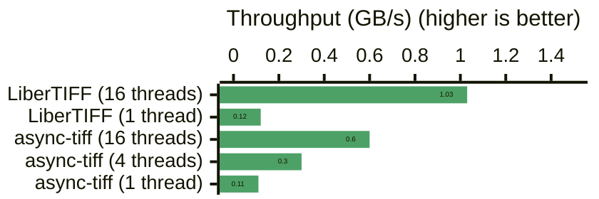
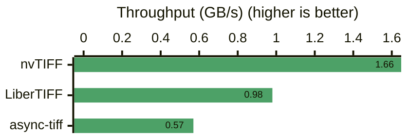

# Accelerating GeoTIFF readers with Rust 🦀

::subtitle::
A tour of decoding TIFFs using multi-threaded, asynchronous and GPU-accelerated methods

<DecorativeRectangle
  width="50%"
  height="40%"
  zIndex=20
  :position="{
    bottom: '2%',
    right: '2%',
  }"
  :customStyle="{ mixBlendMode: 'multiply' }"
>
  <!-- You can place content _inside_ of rectangles! -->
  <div w-full h-full relative flex flex-col items-end justify-end p-4 text-white text-right>
    <h3 text-5xl>
      FOSS4G 2025 talk
    </h3>
    <h4 text-md font-mono>
      Thursday 20 Nov 2025 <br> 16:30-16:55 (NZDT)
    </h4>
    <h5 text-sm>
      Wei Ji Leong <code text-primary> @weiji14</code>
    </h5>
  </div>
</DecorativeRectangle>
<LogoHorPos position="top-left" height="24px" />

---
layout: image-right
class: bg-white text-black m-5
image: https://gdal.org/en/latest/_images/raster_data_formats.svg
backgroundSize: contain
---

# GeoTIFF 🧇

The most common raster format in GDAL's 2024 user survey!
<br>
<br>
### Libraries covered today

* **LiberTIFF** driver in GDAL 3.11+ <br>(multi-threaded & thread-safe)
* **async-tiff** 🦀 (asynchronous TIFF reader)
* **nvTIFF** (GPU-accelerated)
<!-- * image-tiff 🦀 (used in georust/geotiff) -->

> <small>Only looking at reading/decoding,<br> to either CPU and GPU memory </small>

<!--
Also supports notes that are displayed in the presenter view. Just make sure that the comment is places at the END of the slide (after logo/rectangles)
-->

---
layout: image-left
image: https://raw.githubusercontent.com/cloudnativegeo/cloud-optimized-geospatial-formats-guide/b0924a1644e4191c1acb495a0b033041d420bf7f/images/cog-diagram.png
class: image-narrow bg-white text-black m-0
backgroundSize: contain
---

## Decoding a GeoTIFF 🥞

<!-- TODO insert meme of GDAL trenchcoat -->

Can be sub-divided into 3 main components

<table>
  <v-click>
  <tr>
    <th>Method</th>
    <th>CPU<br>(C/C++)</th>
    <th>CPU<br>(Rust)</th>
    <th>GPU<br>(CUDA)</th>
  </tr>
  <tr>
    <td>Network/disk transfer</td>
    <td>libcurl</td>
    <td>object_store</td>
    <td>kvikIO/cuFile</td>
  </tr>
  </v-click>
  <v-click>
  <tr>
    <td>Decompression of raw bytes</td>
    <td>libtiff</td>
    <td>flate2/weezl/etc</td>
    <td>nvCOMP/nvJPEG</td>
  </tr>
  </v-click>
  <v-click>
  <tr>
    <td>Parse GeoTIFF tag metadata and data</td>
    <td>libgeotiff</td>
    <td>async-tiff</td>
    <td>nvTIFF</td>
  </tr>
  </v-click>
</table>

<br>

<v-click>

> Typically these components are bundled together,<br> e.g. GDAL combines libcurl/libtiff/libgeotiff
</v-click>

---
layout: image-right
image: https://images.unsplash.com/photo-1722080768196-8983bbbb5c0f
class: image-narrow
---

## What to accelerate? ⏩

1. 🛜 Speedup network transfer
   - See <span v-mark.underline>obstore</span>, or kvikIO Remote I/O (direct-to-GPU)
   <!--Nice thread -> https://github.com/apache/opendal/issues/5090-->

2. 🔪 Reduce header requests / metadata fetches
   - <span v-mark.highlight.orange>Cloud-optimize your GeoTIFF</span> + store TIFF header elsewhere
   - See <span v-mark.underline>rasteret, TACOTIFF, virtual-tiff</span>, etc

3. 🤹 Decode tiles in parallel
   - Use multi-threaded / asynchronous / GPU-accelerated drivers
   - <span v-mark="{ padding: [6, 18], type: 'circle' }"> LiberTIFF / async-tiff / nvTIFF</span>

4. 📀 Hardware-accelerate decompression
   - SIMD or GPU-accelerated decompression algorithms
   - E.g. <span v-mark.underline>zune-jpeg (CPU), nvJPEG/nvCOMP/etc (GPU)</span>

**Will cover 3 & 4 in this talk. But find me later if interested in 1 & 2!**

<!--
## Highlight and cross-off text

Use `v-mark` + [Rough Notation](https://roughnotation.com/) to draw attention or indicate rejected options:

- `v-mark.highlight.orange` - <span v-mark.highlight.orange>Highlight text and <code>code</code></span>
- `v-mark.crossed-off` - <span v-mark.crossed-off>Cross off text</span>
- `v-mark.strike-through` - <span v-mark.strike-through>Strike through text</span>
- `v-mark.circle` - <span v-mark.circle>Circle text</span>
- `v-mark.underline` - <span v-mark.underline>Underline text</span>

[📔 Docs](https://sli.dev/features/rough-marker.html)
-->

<LogoHorNegMono position="bottom-right" />

---
layout: image-left
image: https://planetarycomputer.microsoft.com/api/data/v1/item/preview.png?collection=sentinel-2-l2a&item=S2A_MSIL2A_20241029T074031_R092_T37MBV_20241029T111159&assets=visual&asset_bidx=visual%7C1%2C2%2C3&nodata=0&format=png
backgroundSize: 96%
---

## Benchmark image 🛰️

Sentinel-2 True-Colour Image (TCI) file with 3 bands in uint8 dtype, image taken over Kenya.

- Original image is `S2A_37MBV_20241029_0_L2A/TCI.tif`, DEFLATE compression (318.0MB)
- Converted to tiled GeoTIFF (272.2MB) with:
  - LZW compression
  - Predictor: 2 (Horizontal differencing)
  - Block size: 256 x 256

  ```bash
  gdal raster convert --co COMPRESS=LZW \
                      --co TILED=YES \
                      --co PREDICTOR=2 \
                      TCI.tif TCI_lzw.tif
  ```

<!-- Image taken from https://github.com/microsoft/pytorch-cloud-geotiff-optimization/blob/5fb6d1294163beff822441829dcd63a3791b7808/configs/search.yaml#L6 -->

<!--
Image taken from 
-->

---
layout: two-cols
gap: 8
leftRatio: 50
---

<div mt-5 />

## Bench #1 - Read to CPU

<p><br></p>


<p><br></p>

#### Timings to read sample TCI GeoTIFF (272.7MB)

- LiberTIFF (from GDAL 3.11):
  - 16 threads - <span v-mark.highlight.orange>0.26s</span>
  - 1 thread - 2.2s
- async-tiff
  - 16 threads - <span v-mark.highlight.orange>0.45s</span>
  - 4 threads - 0.90s
  - 1 thread - 2.58s
<!-- image-tiff or GDAL GTiff?-->

::right::

<div mt-5 />

### &nbsp;
<p><br></p>

Ran on Intel 12th Gen Intel Core i5-12600HX processor

Sample LiberTIFF reader code:

```rust
// GDAL LiberTIFF code
let options = DatasetOptions {
    open_flags: GdalOpenFlags::default(),
    allowed_drivers: Some(&["LIBERTIFF"]),
    open_options: Some(&["NUM_THREADS=16"]),
    sibling_files: None,
};
let ds = Dataset::open_ex(fpath, options)?;
for b in 1..3 {
    let band = ds.rasterband(b)?;
    let buffer: Buffer<u8> = band.read_band_as::<u8>()?;
    let mut array: Array2<_> = buffer.to_array()?;
    assert_eq!(array.shape(), [10980, 10980]);
```

Full code at https://github.com/weiji14/foss4g2025

<LogoHorPos position="bottom-right" height="24px" />

<DecorativeRectangle
  width="19%"
  height="17%"
  zIndex=10
  :position="{
    top: '-5%',
    left: '19.5%',
  }"
  :customStyle="{ mixBlendMode: 'multiply' }"
/>

---
layout: two-cols
gap: 8
leftRatio: 50
---

<div mt-5 />

## Bench #2 - Read to GPU

<p><br></p>


<p><br></p>

#### Timings to read sample TCI GeoTIFF (272.7MB)

- nvTIFF (decode to GPU memory) - <span v-mark.highlight.orange>0.16s</span>
- LiberTIFF 16 threads + h2d copy - 0.27s
- async-tiff 16 thread + h2d copy - 0.48s

*h2d copy = host (CPU) to device (GPU) transfer.<br>
Overhead for h2d copy is roughly 0.1 to 0.3s.

::right::

<div mt-5 />

### &nbsp;
<p><br></p>

Ran on an NVIDIA RTX A2000 8GB Laptop GPU.<br>
CPU benchmarks ran on 12th Gen Intel Core i5-12600HX.

Sample nvTIFF-based reader code:

```rust
let v: Vec<u8> = std::fs::read(fpath)?;
let bytes = Bytes::copy_from_slice(&v);

// Init CUDA stream on device (GPU)
let ctx: Arc<CudaContext> = CudaContext::new(0)?; // GPU:0
let cuda_stream: Arc<CudaStream> = ctx.default_stream();

// Decode into DLPack tensor
let cog = CudaCogReader::new(&bytes, &cuda_stream)?;
let tensor: SafeManagedTensorVersioned = cog.dlpack()?;
assert_eq!(tensor.num_elements(), 3 * 10980 * 10980);
```

Full code at https://github.com/weiji14/foss4g2025

<LogoHorPos position="bottom-right" height="24px" />

<DecorativeRectangle
  width="19%"
  height="17%"
  zIndex=10
  :position="{
    top: '-5%',
    left: '19.5%',
  }"
  :customStyle="{ mixBlendMode: 'multiply' }"
/>

---
layout: image-left
image: https://images.unsplash.com/photo-1744968776986-3deb08e40a24
class: image-narrow
---

### Towards hardware-guided optimization

For faster decompression and truly parallel decoding 🤹

<br>

#### CPU (e.g. for async-tiff)
- Use more <span v-mark.highlight.orange>efficient decompression</span> algorithms (async-tiff allows you to choose or implement your own!)
- Apply <span v-mark.highlight.orange>SIMD instructions</span> instead of just multi-threading, like what LiberTIFF does

#### GPU (i.e. for nvTIFF)
- Recommend to <span v-mark.underline>send compressed bytes to GPU</span>, decompress and decode on GPU
- Use <span v-mark.underline>hardware decoders</span> if available, e.g. supported by nvJPEG on NVIDIA A100s, nvCOMP on NVIDIA Blackwell Decompression Engine

<!-- - Need to decouple streaming of entire TIFF/COG to GPU, otherwise out of CUDA OOM. Cloud-optimized (with overviews) not necessarily equal to ML-optimized -->

<LogoHorNegMono position="bottom-left" />

---
layout: image-right
image: https://images.unsplash.com/photo-1744968777203-eaf78a31832a
class: image-narrow
---

### ⚙️ cog3pio: one lib to bind them 🦀🐍

High-level Rust/Python bindings to different parallel CPU/GPU engines.
1. Decode into DLPack (supports NumPy, CuPy, Pytorch, etc)
2. Xarray integration (and possibly with cupy-xarray)

````md magic-move
```python
## CPU decoding
import numpy as np
import xarray as xr
from cog3pio import CogReader

cog = CogReader(path="cog.tif")  # DLPack capsule

# From DLPack to NumPy
array: np.ndarray = np.from_dlpack(cog)

# Xarray
dataarray: xr.DataArray = xr.open_dataarray("cog.tif", engine="cog3pio")
```
```python
## GPU (CUDA) decoding
import cupy as cp
import torch
from cog3pio import CudaCogReader  # WIP

cog = CudaCogReader(path="cog.tif")  # DLPack capsule

# From DLPack to CuPy/Pytorch
tensor: cp.ndarray = cp.from_dlpack(cog)
tensor: torch.Tensor = torch.from_dlpack(cog)

# cupy-xarray
# ?
```
````

Source code: https://github.com/weiji14/cog3pio


<!--

### Next year:

- Sort out wheel packaging situation - proper free-threaded Python with CUDA?!
- Get georust/geotiff to use async-tiff backend

-->

<LogoHorNegMono position="bottom-right" />

---
layout: title
image: https://images.unsplash.com/photo-1515899199927-d4cf9e8cef30
---

<h1 text-6xl>Future plans</h1>

Exciting stuff I'd like to work on next:

1. cuFile / NVIDIA GPU Direct Storage support 🚀
2. Integration with Mojo/Modular stack 🔥
   - Imagine GPU-decoding on AMD GPUs or Apple Silicon chips

<small>P.S. Slides/code are at https://github.com/weiji14/foss4g2025</small>

<DecorativeRectangle
  width="35%"
  height="90%"
  zIndex=11
  :position="{
    bottom: '2%',
    right: '2%',
  }"
  :customStyle="{ mixBlendMode: 'multiply' }"
>
  <div w-full h-full relative flex flex-col items-start justify-between p-4 text-white text-left class="[&_a]:no-underline [&_a]:text-white [&_a:hover]:text-gray-200">
    <div mb-4 flex flex-col gap-5 items-start justify-start text-sm font-mono class="[&_a]:flex [&_a]:items-center [&_a]:gap-1">
      <Logo src="/images/logos/hor--neg-mono@2x.png" height="24px" alt="DevelopmentSeed" class="!relative !top-0 !left-0" />
      <a href="https://github.com/developmentseed" target="_blank" title="GitHub">
        <GitHubIcon size="20" pr-1 />
        <span>@developmentseed</span>
      </a>
      <a href="mailto:hello@developmentseed.org" title="Email">
        <EmailIcon size="20" pr-1 />
        <span>weiji@developmentseed.org</span>
      </a>
      <a href="https://fosstodon.org/@developmentseed" target="_blank" title="LinkedIn">
        <MastodonIcon size="20" pr-1 />
        <span>@developmentseed@fosstodon.org</span>
      </a>
      <!-- <a href="https://developmentseed.org/careers" target="_blank" class="font-sans" text-xs text-strong text-italics>
        <span pr-1>🚀</span>
        We're hiring!
      </a> -->
      <CurrentUrlQRCode
        width="150" height="150"
        image='/images/logos/symbol--neg-mono@2x.png'
        url="https://github.com/weiji14/foss4g2025"
        :dotsOptions="{ type: 'classy-rounded', color: 'white' }"
      />
    </div>
    <div opacity-70 w-100 class="text-[10px]">
      <div>Attributions:</div>
      <div>
        Slide images from <a href="https://unsplash.com/@usgs?utm_source=ds-slides&utm_medium=referral" target="_blank" class="text-white hover:text-gray-200">USGS</a> and <a href="https://unsplash.com/@goyastudio" target="_blank" class="text-white hover:text-gray-200">Goya Studio</a> on <a href="https://unsplash.com/?utm_source=ds-slides&utm_medium=referral">Unsplash</a>
      </div>
    </div>
  </div>
</DecorativeRectangle>
